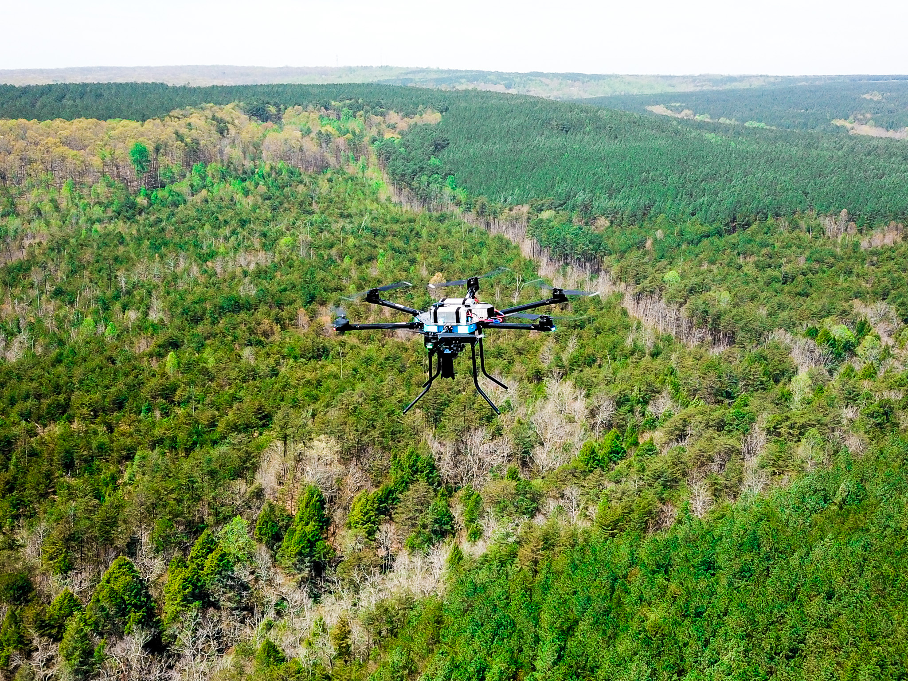

# Abstract

Digital_Forest is a deep learning pipeline for species detection and classification of mixed forest canopies using UAV imagery. This workflow combines transfer learning of two pretrained convolutional neural networks (CNNs) to predict tree species and forest composition from high-resolution RGB imagery. The procedures below outline training and evaluation of a model to detect Eastern Hemlock (Tsuga canadensis), currently threatened by invasive Hemlock Woolly Adelgid (Adelges tsugae) in the eastern United States. This deep learning system can aid conservation efforts by providing geo-referenced data and health metrics on individual stands across large forest plots with a single flyover. Furthermore, the workflow outlines a reliable system for creating forest inventories with extreme accuracy (>95%), and can be extended to other species using similar training pipelines. This repository is intended as an archive for predictive forest composition models, where collaborators are invited to contribute datasets and models to expand its utility for various species across diverse ecosystems.

# Dependencies

**[EfficientNet](https://github.com/tensorflow/tpu/tree/master/models/official/efficientnet)** ([Tan & Le, 2019](https://arxiv.org/abs/1905.11946)):  
EfficientNet is a scalable CNN developed by Mingxing Tan and Quoc V. Le at Google AI. It is known that CNN accuracy can be increased by increasing the model depth, width, and or input resolution. EfficientNet achieves state-of-the-art accuracy with fewer parameters and FLOPs, and provides users with a scalable model optimized based on input resolution. The base model (EfficientNetB0) is used in this project for binary classification (e.g., Hemlock vs. Other) of tree species from image crops with transfer learning. Transfer learning is implemented during training by freezing the base layers. Hyperparameters from the baselayers (learned on ImageNet) consist of elementary features such as edges and shapes derived form ReLU convolutions/maxpooling. The top layer refers to the fully connected (dense) top layers, which learn high-level features like  needle geometry and canopy structure. The final dense layer produces probability distributions from a softmax classifier for each datapoint. Transferring weights learned from baselayers saves computational resources and can prevent overfitting to a particular dataset. For an in-depth tutorial of transfer learning and fine-tuning with EfficientNet, see [Keras Tutorial](https://keras.io/examples/vision/image_classification_efficientnet_fine_tuning/)

**Packages**:
- tensorflow
- keras
- opencv-python
- scikit-learn

---

**[DeepForest](https://github.com/weecology/DeepForest)** ([Weinstein et al., 2020](https://doi.org/10.1038/s41597-020-0449-9)):  DeepForest is a deep learning model built on the RetinaNet architecture, designed to delineate individual tree canopies from RGB imagery. In this workflow, DeepForest is used to extract images of individual trees from the orthomosaic. The extracted images retain their geospatial data and are used as input for our classification model.

**Packages**:
- torch
- numpy
- pandas
- matplotlib
- rasterio
- shapely
- geopandas

# 📁 Datasets

Access datasets here --> [**Digital_Forest(Eastern_Hemlock)**](https://drive.google.com/drive/u/0/folders/1YnQZ7y3IukW2y54vOSj_UeLdAtgCfOc_)

&nbsp; &nbsp; &nbsp; Drag the shared folder to My Drive to access a copy 

**Training:** Balanced dataset composed of images from multiple flights to account for brightness, contrast, and seasonality variations. More variation in the dataset reduces the model's tendency to overfit to the training data. Training data categories are balanced in size so that the CNN does not favor feature learning for one category over the other. Assigning class weights can improve an imbalanced dataset, but if the imbalance is significant enough, learning will be skewed regardless of applied weights. 
   
**Prediction:** This is the full dataset extracted from an orthomosaic generated from a single flight. 

# Process

- Open the Dataset/Shared folder in Google Drive. Drag the shared folder from "Shared With Me" to "My Drive" to create a copy.
- Open the Species_Classification_Train_CNN.ipynb notebook in this repository.
- Mount Google Drive and import necessary libraries.

### Training a model from scratch with transfer learning

- Load the training data. Resize images to match model input resolution (e.g., EfficientNetB0 requires 224x224 pixel input). Batch size determines the number of images being processed for each step. Epoch refers to a full cycle through the training data. Split the training dataset of each class into training & validation subsets (e.g., 80/20). 

- Apply augmentation to images for regularization and optimize training with prefetching

- Initialize EfficientNetB0. Set "include_top=False" for transfer learning - this freezes learning on the base layers (previously learned from ImageNet). Use class weights on imbalanced datasets. 

- Train the model. Set epochs = 20 to start. The model will backpropagate (adjust weights) based on the loss function given at the end of each epoch. 

- Save the model weights and accuracy logs to your Google Drive.

- Evaluate the model. A well-trained model will show a gradual increase in accuracy, with little difference between training/validation datasets. Discrepencies between validation and training datasets indicate overfitting, meaning the model memorized the training data instead of learning distinguishing features. Additionally, validation loss should decrease at a comparable rate to training loss, indicating effective backpropagation and adjustment of weights/parameter coefficients. Fine-tuning can be achieved by adding dropout learning, additional data augmentation, or increasing the model input resolution. 

- An overfit model will show little to no improvement on validation sets. 

### Prediction
To make predictions from our pretrained model (located in Google Drive ) for Eastern Hemlock detection on your own dataset:

- skip to Step 6 in the Colab notebook and load the saved model weights.
- Run predictions on the full prediction dataset extracted by DeepForest.
- Results will be saved with predicted labels and probabilities.

  
### Output
Model predictions are merged with the combined metadata file, which contains image filenames, lat/lon coordinates, and bounding box information obtained from the original DeepForest predictions. The final output is a CSV that can be imported into QGIS or other GIS software to visualize detected species across the forest plot.

### Building your own dataset

**Flight**: Viable datasets must contain high resolution RGB images (~2 cm/pixel GSD). There are many commercially available drones capable of conducting grid surveys. Third-party software such as [MapPilot Pro](https://www.mapsmadeeasy.com/map_pilot/) and [Litchi](https://flylitchi.com/) perform reliably with most DJI models. Premium DJI models have native mapping software. For optimal results, conduct surveys at constant altitude above ground level (AGL), and ensure overlap along the path exceeds 85%. Across-path overlap should be greater than 80%.

For large forest plots ( > 20 acres), DSLR cameras with 24+ megapixel sensors attached to custom drones can reduce the number of required images, extend flight times, and increase mission efficiency. For this project, we constructed a custom Pixhawk Hexacopter, fitted with a 24 megapixel Sonny DSLR camera. Flight plans were made in [Mission Planner](https://ardupilot.org/planner/docs/mission-planner-overview.html) at 95m AGL with 90% overlap along path and 85% across, yielding a calculated ground sampling distance (GSD) of ~2cm/pixel. Images were georeferenced using CAM messaging via ArduPilot. 

**Orthomosaic Generation**: Stitch raw imagery into a georeferenced orthomosaic before delineating the canopy with [DeepForest](https://github.com/weecology/DeepForest). This ensures that extracted images contain geographical data.[WebODM](https://www.opendronemap.org/webodm/) is a free, open-source Docker program capable of rendering high-resolution orthomosaics. For large datasets (1000+ images), consider deploying an AWS Elastic Container to process your orthomosaic with GPU or TPU capability. Paid services like [Pix4D](https://www.pix4d.com/) and [Agrisoft](https://www.agrisoftllc.com/) are easy to contain many additional features.

**Tree Crown Delineation**: With the orthomosaic ready, use the [DeepForest](https://deepforest.readthedocs.io/en/latest/) Python library to delineate individual tree crowns from the forest canopy. This will produce bounding boxes/geometries around each tree crown. Downsample your GeoTIFF file to 10cm/pixel (the same GSD DeepForest was trained on).  Adjust patch size and overlap parameters for best fit. For optimal results, annotate your predictions with additional training. Save predictions as a shapefile (.shp) to import into a GIS program.

**Image Extraction**:  Open your DeepForest predictions in QGIS or another GIS program, select your target class specimens by labeling them (1 = target class, 0 = other), and then export each class as a separate shapefile. Then, overlay the classified shapefiles onto your orthomosaic (separately) and crop images from the bounding boxes for each tree crown produced by your DeepForest predictions. Shapefile geometry must be converted from geographical coordinates to pixel coordinates before image crops can be completed. DeepForest includes a [CropModel](https://deepforest.readthedocs.io/en/latest/user_guide/03_cropmodels.html) function to automate cropping in Python. Save pixel coordinates (xmin, ymin, xmax, & ymax) as metadata for each file to match species predictions from the EfficientNet classification to your original orthomosaic geography. Choose your preferred framework (Python, C+++, Java, etc.) for this step. An example .ipynb file is included in this repository for guidance. 

---

Contributions are welcome. Submit pull requests or issues for dataset formats, model integration, or results interpretation.
